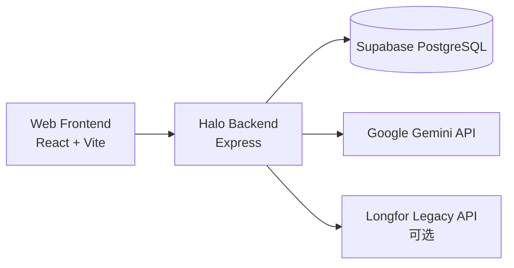

# Halo 运维部署文档

## 1. 文档说明

本文档用于指导 Halo 项目的本地开发、数据库初始化、数据导入、生产部署和运行巡检。内容以当前仓库实现为准。

## 2. 系统架构



说明：

- 前端默认运行在 `3000` 端口。
- 后端默认运行在 `8787` 端口。
- 生产环境后端优先读取平台注入的 `PORT`。

## 3. 运行环境要求

### 3.1 基础软件

- Node.js 22.x
- npm 10.x 及以上
- 可访问的 Supabase 实例

### 3.2 可选能力

- Gemini API Key：启用大模型生成
- Docker：容器化部署
- Render：托管后端服务

## 4. 目录与关键文件

| 路径 | 说明 |
| --- | --- |
| `src/` | React 前端源码 |
| `server/` | Express 后端源码 |
| `supabase/migrations/` | 数据库迁移脚本 |
| `supabase/seed.sql` | 初始化演示数据 |
| `scripts/setup-supabase.ts` | 数据库初始化脚本 |
| `scripts/import-energy-reports.ts` | Excel 能耗数据导入脚本 |
| `server/report-templates/` | 报告模板文件 |
| `Dockerfile` | Docker 部署文件 |
| `render.yaml` | Render 部署配置 |
| `.env.example` | 环境变量模板 |

## 5. 环境变量说明

### 5.1 必填变量

| 变量名 | 用途 |
| --- | --- |
| `SUPABASE_URL` | Supabase 项目地址 |
| `SUPABASE_SERVICE_ROLE_KEY` | 服务端访问数据库的高权限 Key |
| `SUPABASE_DB_URL` | PostgreSQL 连接串，供数据库初始化脚本使用 |

### 5.2 推荐配置

| 变量名 | 用途 |
| --- | --- |
| `API_PORT` | 本地后端监听端口，默认 `8787` |
| `CORS_ORIGIN` | CORS 白名单，逗号分隔 |
| `VITE_API_BASE_URL` | 前端访问后端的基础地址 |
| `GEMINI_API_KEY` | 启用 AI 生成能力 |
| `GEMINI_MODEL` | AI 模型名，默认可配为 `gemini-2.5-flash` |

### 5.3 Longfor 兼容接口变量

仅在使用 `/api/energy/query-report-legacy` 时需要：

- `LONGFOR_QUERY_REPORT_URL`
- `LONGFOR_USER_INFO_URL`
- `LONGFOR_AUTHORIZATION`
- `LONGFOR_X_GAIA_API_KEY`
- `LONGFOR_CASTGC`

## 6. 本地部署步骤

### 6.1 安装依赖

```bash
npm install
```

### 6.2 配置环境变量

复制模板并填写实际值：

```bash
copy .env.example .env.local
```

至少需要补充：

- `SUPABASE_URL`
- `SUPABASE_SERVICE_ROLE_KEY`
- `SUPABASE_DB_URL`

如需启用 AI：

- `GEMINI_API_KEY`
- `GEMINI_MODEL`

### 6.3 初始化数据库

```bash
npm run db:setup
```

脚本行为：

- 顺序执行 `supabase/migrations` 下全部 SQL
- 执行 `supabase/seed.sql`
- 建立表、视图、触发器与演示数据

### 6.4 启动开发环境

```bash
npm run dev
```

启动结果：

- 前端：`http://localhost:3000`
- 后端：`http://localhost:8787`

说明：

- Vite 已配置 `/api` 代理，开发时前端可直接请求后端。

## 7. 数据初始化与导入

## 7.1 初始化演示数据

执行 `npm run db:setup` 后会自动写入：

- 演示项目 `demo-campus`
- 演示系统集成记录
- 近 6 天按 4 小时生成的能耗指标
- 两条分析报告记录

## 7.2 导入 Excel 能耗数据

命令：

```bash
npm run db:import-energy -- <Excel文件路径1> <Excel文件路径2>
```

如果不传路径，脚本会尝试在默认桌面目录查找约定后缀文件。

脚本行为：

- 解析首个工作表
- 将第 7 列开始的日期列转为样本日期
- 生成项目与明细记录
- 写入本地缓存文件 `server/data/imported-energy-data.json`
- 若已配置 Supabase，则同步 upsert 到数据库

导入后会更新以下数据：

- `projects`
- `energy_metrics`
- `energy_query_records`

## 8. 构建与启动

### 8.1 构建前端

```bash
npm run build
```

输出目录：

- `dist/`

### 8.2 构建后端

```bash
npm run build:server
```

输出目录：

- `dist-server/`

### 8.3 启动后端生产包

```bash
npm run start:server
```

实际执行：

```bash
node dist-server/server/index.js
```

## 9. Docker 部署

### 9.1 构建镜像

```bash
docker build -t halo-backend .
```

### 9.2 启动容器

```bash
docker run --env-file .env.local -p 8787:8787 halo-backend
```

### 9.3 Dockerfile 说明

当前 Dockerfile 采用多阶段构建：

- `base`：安装依赖
- `build`：编译服务端并剔除开发依赖
- `runtime`：仅保留运行所需文件

容器中会保留：

- `dist-server`
- `node_modules`
- `server/report-templates`

## 10. Render 部署

仓库已提供 `render.yaml`，核心参数如下：

- 服务类型：`web`
- 运行时：`node`
- 构建命令：`npm ci && npm run build:server`
- 启动命令：`npm run start:server`
- 健康检查：`/api/health`

Render 需配置的关键环境变量：

- `CORS_ORIGIN`
- `GEMINI_API_KEY`
- `GEMINI_MODEL`
- `SUPABASE_URL`
- `SUPABASE_SERVICE_ROLE_KEY`
- `SUPABASE_DB_URL`
- `LONGFOR_AUTHORIZATION`
- `LONGFOR_X_GAIA_API_KEY`
- `LONGFOR_CASTGC`
- `LONGFOR_QUERY_REPORT_URL`
- `LONGFOR_USER_INFO_URL`

说明：

- 线上端口无需手动写死，服务端会优先读取平台注入的 `PORT`。

## 11. 前端部署说明

如果前端单独部署到静态站点平台，需要配置：

```bash
VITE_API_BASE_URL=https://你的后端域名
```

例如：

```bash
VITE_API_BASE_URL=https://halo-backend.onrender.com
```

注意：

- `vite.config.ts` 使用 `base: './'`，可兼容静态部署与文件预览。
- 前端在 `file://` 场景下如果未配置 `VITE_API_BASE_URL`，将无法调用 Halo API。

## 12. 健康检查与巡检

## 12.1 健康检查接口

接口：

```http
GET /api/health
```

返回关注项：

- `status`
- `database.configured`
- `database.reachable`
- `database.schemaReady`
- `database.projectCount`
- `serverTime`

## 12.2 建议巡检项

- 后端进程是否存活
- `/api/health` 是否返回 `ok`
- Supabase 是否可访问
- `projects` 表是否有数据
- `energy_query_records` 是否存在导入项目
- Gemini Key 是否失效
- CORS 是否正确放通前端域名

## 12.3 常见故障排查

### 问题 1：前端打开后提示接口返回 HTML

原因：

- 未启动后端
- 静态前端未配置 `VITE_API_BASE_URL`

处理：

- 本地启动 `npm run dev`
- 或为部署环境补充 `VITE_API_BASE_URL`

### 问题 2：`/api/health` 返回 degraded

原因：

- 未配置 `SUPABASE_URL` 或 `SUPABASE_SERVICE_ROLE_KEY`

处理：

- 检查 `.env.local` 或平台环境变量

### 问题 3：`/api/health` 返回 error

原因：

- 数据库不可达
- 表结构未初始化

处理：

- 检查 Supabase 网络连通性
- 重新执行 `npm run db:setup`

### 问题 4：智能对话能发起但回复是本地兜底内容

原因：

- 未配置 `GEMINI_API_KEY`
- Gemini 调用异常

处理：

- 检查 Gemini Key 与模型名
- 查看后端日志确认外部 API 调用情况

### 问题 5：能耗查询没有项目可选

原因：

- `projects` 中没有带 `metadata.source = energy-report-import` 的项目
- `energy_query_records` 未导入

处理：

- 先执行 Excel 导入脚本
- 校验 `projects.metadata` 和 `energy_query_records` 数据

## 13. 安全与权限注意事项

- `SUPABASE_SERVICE_ROLE_KEY` 只能用于服务端，不可注入前端。
- 当前数据库已启用 RLS，但迁移未定义策略，实际访问依赖 Service Role。
- 建议生产环境限制 `CORS_ORIGIN`，不要长期放开 `*`。
- 建议将 `.env.local`、日志、导入文件纳入运维安全管理。

## 14. 备份与恢复建议

### 14.1 需要关注的数据

- `projects`
- `system_integrations`
- `energy_metrics`
- `analysis_reports`
- `chat_sessions`
- `energy_query_records`

### 14.2 建议策略

- 使用 Supabase 平台能力做数据库定时备份
- 导入原始 Excel 文件单独归档
- 报告模板目录纳入 Git 管理

## 15. 发布检查清单

- 已填写生产环境变量
- 已完成数据库迁移
- `/api/health` 正常
- 前端已配置正确后端地址
- 已导入正式项目的能耗查询数据
- AI Key、生效模型和配额已校验
- CORS 白名单已收敛
